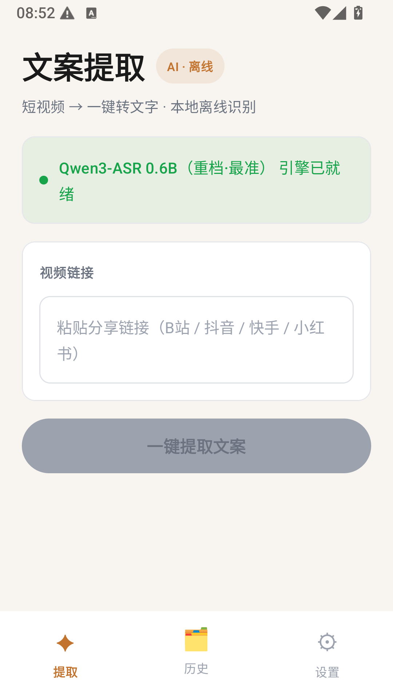
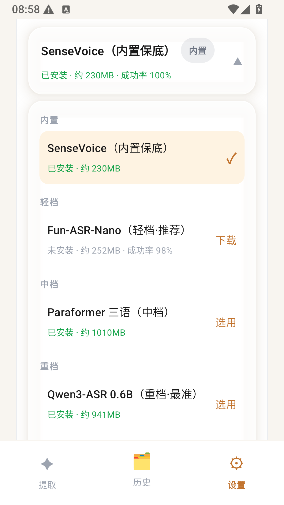
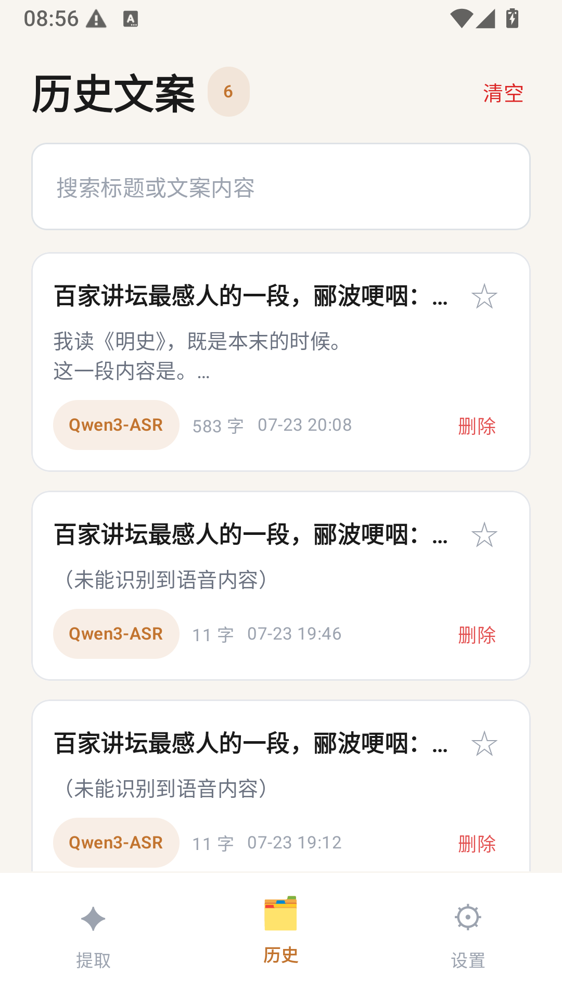
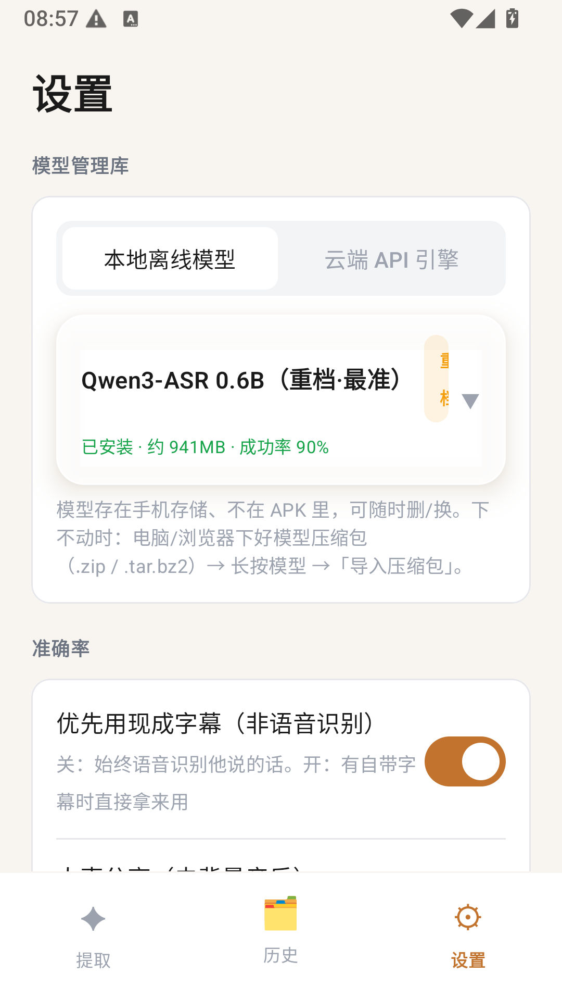

# 文案绫波

> 原名 BiliTranscript。Turn what is **spoken** in a Bilibili video into text — using **on-device AI**, fully offline, nothing sent to the cloud.

Paste a Bilibili link → download the audio → recognize the speech locally → copy / share / export in one tap. Works for Chinese, English, Japanese, Korean and Cantonese, and lets you switch between on-device models such as SenseVoice (fast) and Whisper (accurate).

  

> Note: the app's UI is in Chinese because the target content (Bilibili) is Chinese. This README is in English for international readers.

---

## ✨ Features

- 🎙️ **On-device speech recognition** — powered by the offline [sherpa-onnx](https://github.com/k2-fsa/sherpa-onnx) engine. No network, no uploads, privacy-friendly.
- 🧩 **Model store (models are NOT bundled in the APK)** — models live in phone storage and are auto-detected. You can **download / import a zip / delete / switch** models, keeping the APK small.
- 🌏 **Multilingual** — Chinese, English, Japanese, Korean, Cantonese; auto-detect or force a language.
- 🔗 **Flexible link parsing** — BV id / AV id / `b23.tv` short links / raw "share text" are all accepted.
- 📲 **Share sheet + clipboard** — "Share to" the app directly from Bilibili; on launch it auto-detects a Bilibili link in the clipboard.
- 🗂️ **History** — every extraction is saved automatically; searchable, favoritable, one-tap reopen, deletable.
- 🫧 **Floating ball** — run extraction in the background with progress in the notification.
- 💾 **Export** — copy, share, save as TXT; subtitle-sourced results can export timed SRT.
- 🎨 **Polished UI** — dark glassmorphism with aurora accents and a three-tab bottom navigation.

## 📸 Screenshots

| Extract | Model Store |
|---------|-------------|
|  |  |

| History | Settings |
|---------|----------|
|  |  |

---

## 🧱 Tech Stack

| Component | Purpose |
|-----------|---------|
| Kotlin + Jetpack Compose (Material 3) | UI |
| [sherpa-onnx](https://github.com/k2-fsa/sherpa-onnx) `1.13.4` | On-device speech recognition (JNI + ONNX Runtime) |
| SenseVoice / Fun-ASR-Nano / Paraformer / Qwen3-ASR | Switchable recognition models (built-in + light/mid/heavy tiers) |
| OkHttp + kotlinx.serialization | Bilibili API access & downloads |
| Apache Commons Compress | tar.bz2 model bundle extraction |
| MediaCodec | Audio decoding (m4a → 16 kHz PCM) |
| ViewModel + StateFlow | Unidirectional data flow |

**Architecture:** link parsing → stream download → decode → (optional vocal separation) → recognition, all flowing through a single shared `TranscriptionPipeline`. The main screen and the floating-ball service reuse the same pipeline.

## 📂 Repository Structure

```
.
├── android-app/                 # The Android app (main project)
│   └── app/src/main/java/com/example/bilitranscript/
│       ├── MainActivity / *Screen.kt     # Compose UI, 3 tabs (Extract / History / Settings)
│       ├── MainViewModel.kt              # State & actions
│       ├── TranscriptionPipeline.kt      # Shared extraction pipeline
│       ├── BiliDownloader.kt             # Bilibili parsing & audio download
│       ├── SpeechRecognizer.kt           # sherpa-onnx recognition (from assets or phone storage)
│       ├── ModelManager.kt               # Model store: download / import / delete / detect
│       └── ...
├── scripts/setup-models.{ps1,sh}# Fetch the bundled SenseVoice model
├── docs/python-desktop.md       # The earlier Python/Flask desktop prototype
└── README.md
```

---

## 🚀 Quick Start (Android)

### Prerequisites
- Android Studio (with the Android SDK, `compileSdk 36`)
- JDK 21
- An Android 7.0+ device with USB debugging enabled

### 1. Fetch the bundled model (required)
The bundled SenseVoice model is ~239 MB, which exceeds GitHub's per-file limit, so it is **not committed**. After cloning, run once:

```powershell
# Windows
powershell -ExecutionPolicy Bypass -File scripts\setup-models.ps1
```
```bash
# macOS / Linux
bash scripts/setup-models.sh
```
> This places the model into `android-app/app/src/main/assets/models/`. The sherpa-onnx AAR is already included in the repo, so no extra download is needed for it.

### 2. Build & install
```bash
cd android-app
./gradlew assembleDebug
# install onto a connected device
./gradlew installDebug
```
The APK is produced at `android-app/app/build/outputs/apk/debug/app-debug.apk`.

---

## 🧩 Model Management (the core idea)

Only the lightweight **SenseVoice** is packed into the APK (as a no-crash fallback). All other models are managed in-app under **Settings → Model Store** (a liquid-glass dropdown, grouped by light / mid / heavy tiers; **long-press any model** for its ~50-char intro, size, and **install success rate** — an estimate of how easily the model can be pulled from its mirrors, unrelated to recognition accuracy). Three ways to get a model:

| Method | Notes |
|--------|-------|
| **Download** (recommended) | All models are served from **ModelScope** mirrors (fast in mainland China), with 4-way parallel range chunks, per-chunk retry, mirror failover and resumable `.part` files. |
| **Import an archive** | Download the model `.zip` / `.tar.bz2` on a PC/browser → transfer to the phone → long-press the model → **"Import archive"**; the app extracts and installs it automatically (k2-fsa official `tar.bz2` bundles are extracted and stripped of redundant fp32 weights). |
| **adb push** (developers) | See the command below; pushes into the app's private directory. |

Available models (sherpa-onnx format, mirrors verified reachable from mainland China):

| Tier | Model | Size | Notes |
|------|-------|------|-------|
| bundled | SenseVoice-Small | ~230 MB | Fast; zh/en/ja/ko/yue; great on clean speech; built-in fallback |
| light | Fun-ASR-Nano (2025-12) | ~252 MB | New-gen SenseVoice-arch: far-field / noisy / accent-robust; still very fast |
| mid | Paraformer trilingual (zh/en/yue) | ~1 GB bundle (≈245 MB installed) | Industrial-grade zh accuracy with punctuation; auto-extracted after download |
| heavy | Qwen3-ASR 0.6B (2026-03) | ~941 MB | LLM-based transcription; 52 languages + 22 Chinese dialects; most accurate, slowest |

> The former Whisper medium / large-v3 entries were removed: hf-mirror's LFS is broken server-side (302 → cas-bridge 404) and huggingface.co is unreachable from mainland China. The new tiers beat them on both accuracy and availability.

<details>
<summary>Developers: push a model to the device via adb</summary>

```bash
# Example: funasr-nano — push the two files into the app's private dir (run-as works for debug builds)
adb push model.int8.onnx /data/local/tmp/
adb push tokens.txt      /data/local/tmp/
adb shell run-as com.example.bilitranscript mkdir -p files/models/funasr-nano
adb shell run-as com.example.bilitranscript cp /data/local/tmp/model.int8.onnx files/models/funasr-nano/
adb shell run-as com.example.bilitranscript cp /data/local/tmp/tokens.txt      files/models/funasr-nano/
```
</details>

---

## 🖥️ Python Desktop Prototype

The repo root also keeps an earlier Flask web version (`app.py` / `audio_extractor.py`): paste a link in the browser and recognize via local Whisper or the Baidu cloud ASR API. See [docs/python-desktop.md](docs/python-desktop.md). It is an early prototype only; development has moved to the Android app.

## 🗺️ Roadmap

- [ ] Vocal separation (remove background music) wired to a real inference backend
- [ ] VAD segmentation: skip music-only stretches and produce timestamps for every engine → enable SRT export
- [ ] LLM post-processing (punctuation / paragraphing / summary / translation)
- [ ] More platforms (Douyin / Kuaishou / YouTube / Xiaohongshu)

## ⚠️ Disclaimer

For personal study and research only. Please respect Bilibili's Terms of Service and applicable laws; do not use it for copyright infringement or commercial purposes. Recognition results are AI-generated and may contain errors.

## 📄 License

[MIT](LICENSE)
